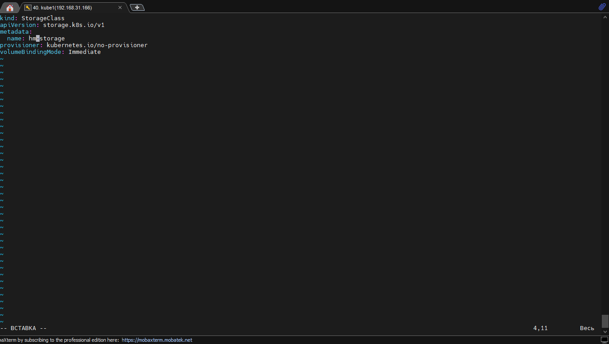

# С помощью Helm необходимо установить Prometheus в кластер

## 1. Для начала создадим пространство имен командой kubectl create namespace monitor
## 2. Установим Prometheus с помощью комады helm installhelm -n monitor prom-test prometheus-community/prometheus
## 3. Для того что бы чарт заработал, необходимо создать StorageClass и PV для PVC

## 4. После создания SC и PV необходимо добавить для созданных PVC SC в манифест, командой  kubectl edit -n monitor pvc storage-prom-test-alertmanager-0 и  kubectl edit -n monitor pvc prom-test-prometheus-server

## 5. Чарт с Prometheus после добавления pv начинает функционировать
